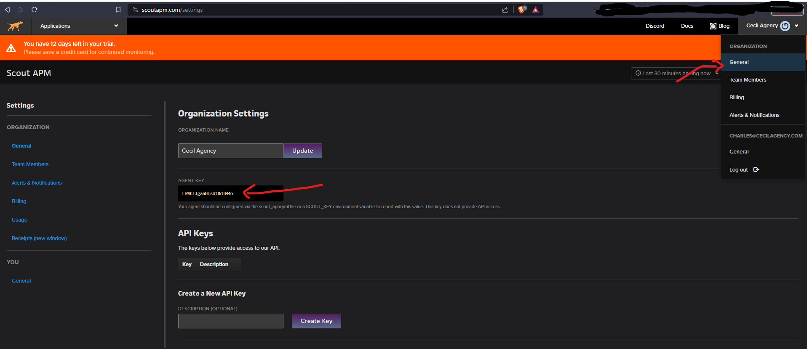

# Getting Started Guide

**Please note that  Scout APM is NOT compatible with Windows. To successfully run this project you need a Linux or macOS computer.**

1. Clone this repository.
2. Navigate into the project folder.
3. Install a Python virtual environment by running `python -m venv venv`. 
4. Activate the virtual environment by running `source venv/bin/activate`. If successful, you should see `(venv)` at the beginning of your terminal prompt.
5. Install Django by running `python -m pip install Django`.
6. Install Scout APM for Django by running `python -m pip install scout-apm`.
7. Sign up for a [Scout APM account](https://scoutapm.com/). A free trial account is fine.
8. Once your scout account is set up, navigate to the [scout settings page](https://scoutapm.com/settings) to retrieve your Scout Agent Key.
9. Back on your computer's file system, open the project settings file located at `scout_blog/settings.py`, then add the agent key you retrieved in the previous step to the `SCOUT_KEY` variable.

10. Run the database migrations using the command `python manage.py migrate`.
11. Create a super user for the Django Admin using the command `python manage.py createsuperuser`.
12. Run the local web server using the command `python manage.py runserver`. Then, in your browser, go to [http://localhost:8000](http://localhost:8000), and you should see the blog app's home page.
13. If you navigate your browser to [http://localhost:8000/admin](http://localhost:8000/admin) you can access the admin page. If prompted to log in, use the credentials you created in step 11.
14. Once you have the app running, you can see the app's metrics via the [Scout APM Dashboard](https://scoutapm.com/apps).